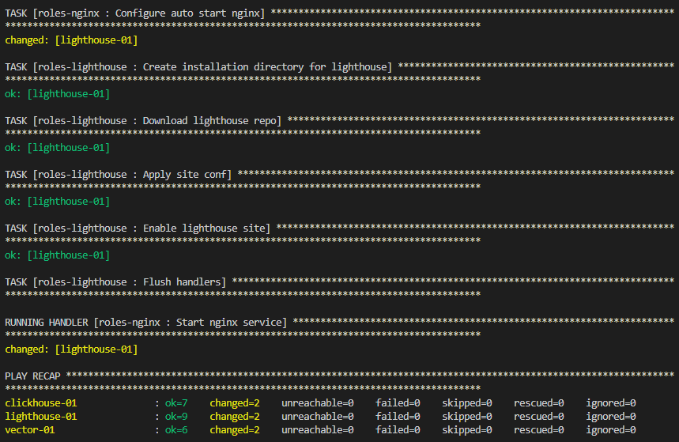

## Версия плейбука

1.0.0

## Описание плейбука

Плейбук устанавливает роли:
- roles-clickhouse
- roles-vector
- roles-lighthouse
Также вместе с ролью **roles-lighthouse** устанавливается связанная роль **roles-nginx**

## Запуск плейбука 
 
Запуск осуществляется плеем [site.yml](site.yml). Для запуска плея используется инвенторифайл [prod.yml](inventory/prod.yml):

**ansible-playbook -i inventory/prod.yml --private-key <key file name> site.yml**

## Результат развертывания

